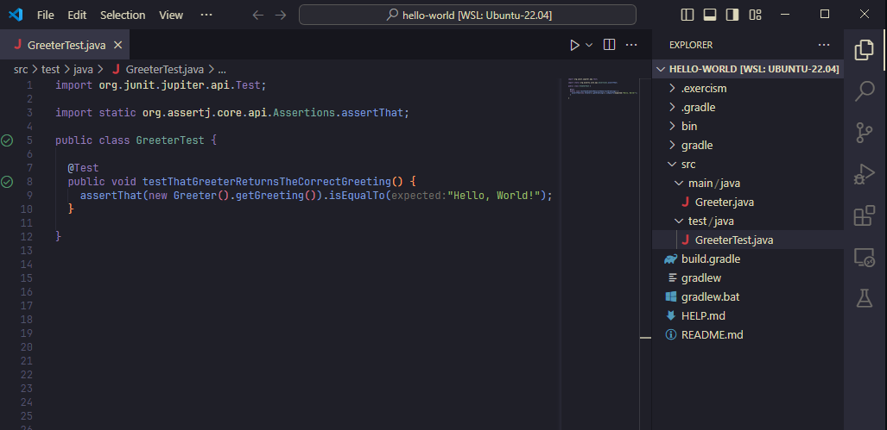

# Exercism | Java Track 

 

 exercism is a free online coding platform where you can select a programming language track and practice through exercises. as you must've guessed, I chose the Java track.

one really interesting thing is that you can either choose to use their online editor or use your own local environment. 

 
> [!IMPORTANT]
> I'm doing the exercises in Windows Subsystem for Linux (WSL II), using VS Code

